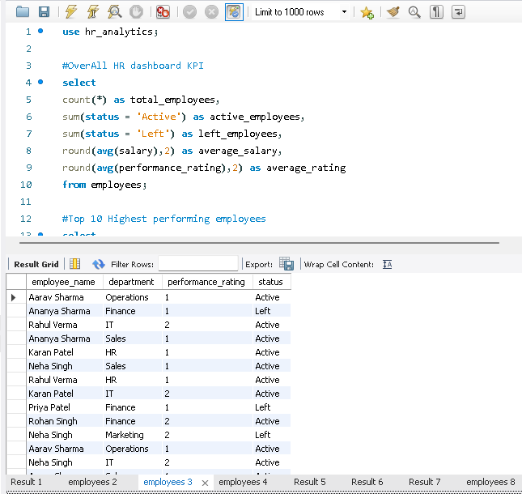
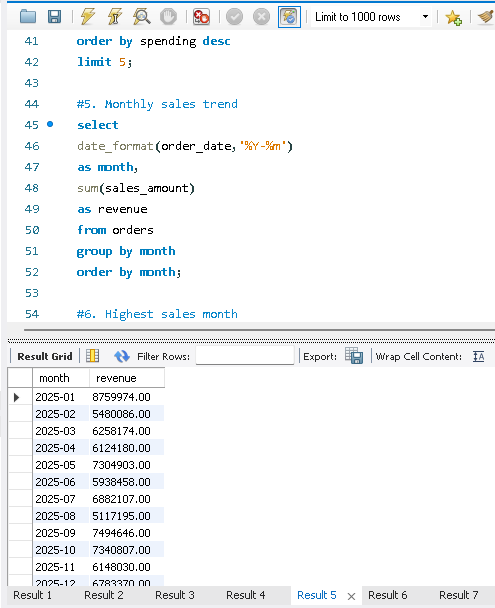
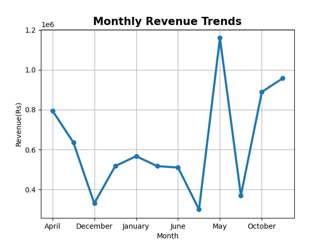
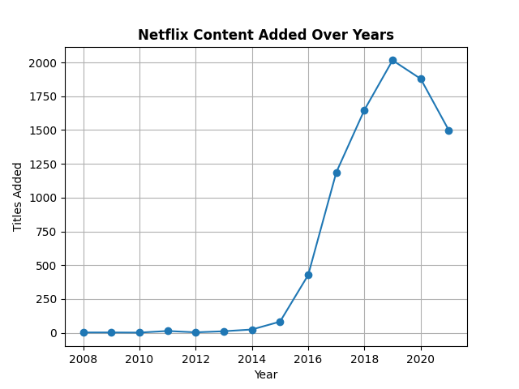
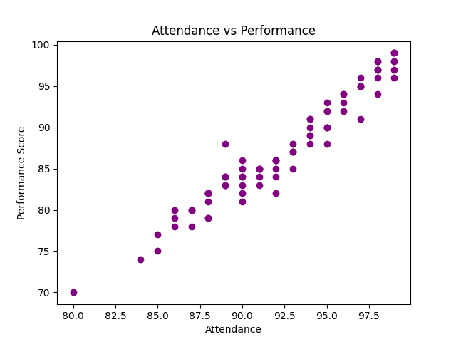
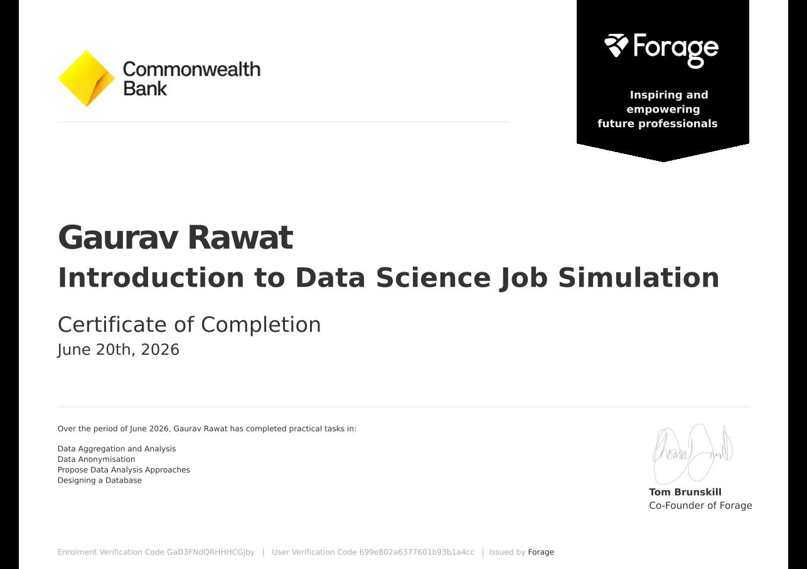
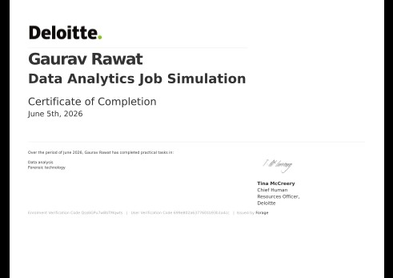
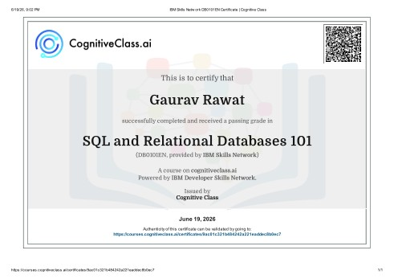
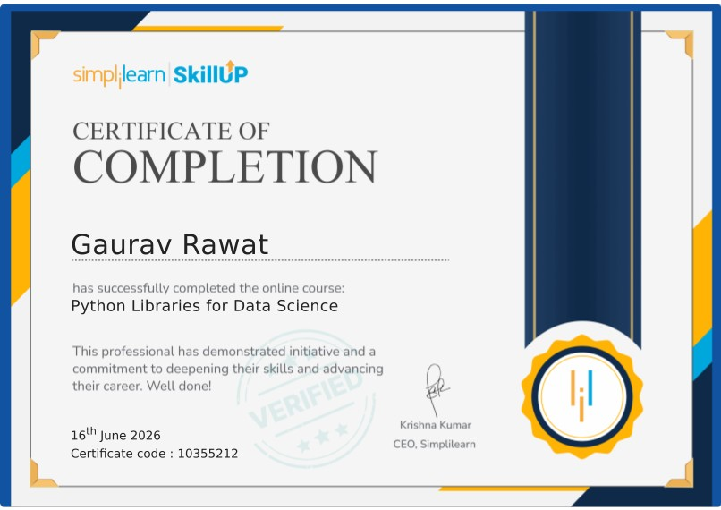

 

  

  

  

# 👨‍💻 About Me

Hi, I'm **Gaurav Rawat**, an aspiring **Data Analyst** passionate about transforming raw data into meaningful stories that help businesses make informed decisions.

I enjoy working across the complete analytics workflow—from cleaning and exploring datasets to building dashboards and communicating actionable insights. My goal is to develop practical analytics solutions that create measurable business impact.

 

## 📌 Professional Snapshot

| | |
|:---|:---|
| 💼 **Role** | Data Analytics & Business Intelligence |
| 📍 **Location** | Dehradun, Uttarakhand, India |
| 🎯 **Open To** | Data Analytics Internship Opportunities |
| 🌐 **Portfolio** | <a href="https://gaurav-portfolio-sandy-ten.vercel.app/">Visit Portfolio</a> |
| 💼 **LinkedIn** | <a href="https://www.linkedin.com/in/gaurav-rawat-bca">Connect on LinkedIn</a> |
| 📧 **Email** | gauravrawatwd@gmail.com |

 

## 🎯 Areas of Expertise

- 📊 Data Analytics
- 📈 Business Intelligence
- 📉 Data Visualization
- 🧹 Data Cleaning & Transformation
- 🔍 Exploratory Data Analysis (EDA)
- 🗄 SQL Analytics
- 📊 Dashboard Development
- 📖 Data Storytelling

 

 

> *"Without data, you're just another person with an opinion."* — W. Edwards Deming

## 🧰 Analytics Toolbox

<table>
<tr>
<td width="50%" valign="top">
  
### 💻 Programming Languages
  

  

</td>
<td width="50%" valign="top">
  
### 📚 Python Libraries

  

</td>
</tr>
<tr>
<td width="50%" valign="top">
  
### 📊 Data Visualization

  

  

</td>
<td width="50%" valign="top">
  
### 🗄 Database

  

</td>
</tr>
<tr>
<td width="50%" valign="top">
  
### ⚙️ Development Tools

  

</td>
<td width="50%" valign="top">
  
### 🧠 Core Skills

- 📊 Data Analytics
- 📈 Business Intelligence
- 🧹 Data Cleaning
- 📉 Exploratory Data Analysis
- 📊 Dashboard Development
- 📖 Data Storytelling
- 📐 Statistics
</td>
</tr>
</table>
 

## 🎯 Analytics Focus

# 📊 GitHub Analytics

 

## 🧠Development Activity

 
 

## 📌 GitHub Overview

| Metric | Value |
|:--|:--|
| 📂 Featured Projects | **5** |
| 🏆 Professional Certifications | **4** |
| 📈 100 Days of Data Analytics | **Active** |
| 🎯 Current Goal | **Data Analytics Internship** |
| 💻 Primary Stack | **Python • SQL • Power BI • Excel** |

# 📌 Project Highlights

| | |
|:--|:--|
| 📂 Featured Projects | **5** |
| 💻 Technologies | **Python • SQL • MySQL • Power BI • Excel** |
| 📊 Dashboards Built | **5+** |
| 📈 Business Problems Solved | **15+** |

 

# 🚀 Featured Projects

Showcasing practical analytics solutions built using Python, SQL, MySQL, Excel and Business Intelligence tools to solve real-world business problems.

 

<table>

<tr>

<td width="50%" valign="top">

### 📊 Employee HR Analytics

Workforce analytics project using SQL to uncover insights into employee attrition, departmental performance, salary distribution, and workforce demographics.

**Tech Stack**

`SQL` `MySQL`

**Key Insights**

- 📉 Employee Attrition Analysis
- 🏢 Department Performance
- 💰 Salary Trend Analysis
- 👥 Workforce Distribution

</td>

<td width="50%" valign="top">

### 🛒 E-Commerce SQL Analytics

Business-focused SQL analytics project exploring customer behaviour, revenue trends, order patterns, and product performance.

**Tech Stack**

`SQL`

**Key Insights**

- 💵 Revenue Analysis
- 👤 Customer Behaviour
- 📦 Product Performance
- 📈 Sales Trends

</td>

</tr>

</table>

 

<table>

<tr>

<td width="50%" valign="top">

### 📈 Online Store Sales Analysis

Business analytics project focused on understanding revenue growth, customer purchasing behaviour, and sales performance through data analysis.

**Tech Stack**

`Python` `Pandas` `Matplotlib`

**Key Insights**

- 🧹 Data Cleaning
- 📊 Exploratory Data Analysis
- 📈 Revenue Trends
- 📉 Visual Reporting

</td>

<td width="50%" valign="top">

### 🎬 Netflix Data Analysis

Exploratory analysis of Netflix content to identify genre popularity, release trends, content distribution, and country-wise insights.

**Tech Stack**

`Python` `Pandas` `Matplotlib`

**Key Insights**

- 🎭 Genre Analysis
- 🌍 Country Analysis
- 📅 Release Trends
- 🎬 Content Distribution

</td>

</tr>

</table>

 

<table>

<tr>

<td width="50%" valign="top">

### 👨‍💼 Employee Performance Analysis

Analytics project evaluating employee productivity, ratings, departmental KPIs, and performance indicators for business decision-making.

**Tech Stack**

`Python` `SQL`

**Key Insights**

- 📈 KPI Analysis
- ⭐ Performance Ratings
- 🏢 Department Comparison
- 💡 Business Insights

</td>

<td width="50%" valign="middle" align="center">

## 📊 Portfolio Summary

**5**

Analytics Projects

---

**15+**

Business Problems Solved

---

**Python • SQL**

Primary Technologies

---

**Business Intelligence**

Real-world Analytics

</td>

</tr>

</table>

# 🏆 Professional Certifications

Industry-recognized certifications and virtual job simulations demonstrating practical skills in Data Analytics, SQL, Python, Business Intelligence and Data Visualization.

# 🏆 Professional Certifications

Industry-recognized certifications and virtual job simulations that validate my practical knowledge in Data Analytics, SQL, Python, Business Intelligence, and real-world problem solving.

<table>

<tr>

<td width="50%" valign="top">

### 🏦 Commonwealth Bank

**Introduction to Data Science Job Simulation**

**Platform**

Forage

**Skills Gained**

- Data Analysis
- Data Cleaning
- Business Insights
- Data Interpretation

</td>

<td width="50%" valign="top">

### 🌏 Deloitte Australia

**Data Analytics Job Simulation**

**Platform**

Forage

**Skills Gained**

- Business Analytics
- Dashboard Thinking
- Data Visualization
- Business Reporting

</td>

</tr>

</table>

 

<table>

<tr>

<td width="50%" valign="top">

### 🗄 SQL & Relational Databases 101

**Platform**

Cognitive Class

**Skills Gained**

- SQL
- Database Design
- Relational Databases
- Query Writing

</td>

<td width="50%" valign="top">

### 🐍 Python Libraries for Data Science

**Platform**

Simplilearn

**Skills Gained**

- Pandas
- NumPy
- Matplotlib
- Data Analysis

</td>

</tr>

</table>

 

## 📈 Certification Summary

| Category | Count |
|:--|:--:|
| 🎓 Professional Certifications | **4** |
| 🏢 Industry Job Simulations | **2** |
| 📊 Analytics Certifications | **4** |
| 🧠 Skills Covered | **SQL • Python • BI • Data Analytics** |

# 📈 100 Days of Data Analytics

Building practical analytics skills through consistent hands-on projects, business case studies, dashboards, SQL challenges, and data storytelling.

 

## 🎯 Challenge Overview

| | |
|:--|:--|
| 🚀 Goal | Build a professional Data Analytics Portfolio |
| 📅 Duration | 100 Days |
| 🟢 Status | Active |
| 💻 Focus | SQL • Python • Excel • Power BI • Business Intelligence |
| 📂 Repository | *Add your repository link here* |

 

## 📊 Progress Dashboard

| Category | Progress |
|:--|:--|
| 📅 Days Completed | **23 / 100** |
| 📂 Analytics Projects | **9** |
| 📊 Dashboards | **5+** |
| 🗄 SQL Practice | **Ongoing** |
| 📈 GitHub Activity | **Consistent** |

 

## 🛠 Technologies Used

 
 

 
 

 

## 🏆 Major Milestones

| ✅ Completed | 🚧 Upcoming |
|:--|:--|
| Day 10 — SQL Fundamentals | Day 30 — Power BI Dashboards |
| Day 20 — Advanced Excel | Day 40 — Statistics |
| Day 23 — Excel Data Analysis | Day 50 — Business Intelligence |
| Python Libraries | Day 60 — Advanced SQL |
| Data Analysis Projects | Day 70 — Python Automation |
| SQL Projects | Day 80 — Portfolio Dashboard |
| GitHub Portfolio | Day 90 — Capstone Project |
| Continuous Learning | Day 100 — Analytics Portfolio Complete |

 

## 📂 Featured Challenge Projects

- 📊 Employee HR Analytics
- 🛒 E-Commerce SQL Analytics
- 📈 Online Store Sales Analysis
- 🎬 Netflix Data Analysis
- 👨‍💼 Employee Performance Analysis

 

## 🎯 Expected Outcomes

✔ End-to-End Analytics Projects

✔ Business-Oriented Problem Solving

✔ Interactive Dashboards

✔ SQL Proficiency

✔ Python for Data Analysis

✔ Data Storytelling

✔ Professional Portfolio Development

# 🤝 Connect With Me

I'm always open to connecting with fellow data enthusiasts, collaborating on analytics projects, discussing business intelligence, or exploring internship opportunities.

Let's connect and build data-driven solutions together.

 

## 💼 Professional Snapshot

| | |
|:--|:--|
| 👤 Name | **Gaurav Rawat** |
| 💼 Role | **Data Analytics & Business Intelligence** |
| 📍 Location | **Dehradun, Uttarakhand, India** |
| 🎯 Looking For | **Data Analytics Internship Opportunities** |
| 🌐 Portfolio | **https://gaurav-portfolio-sandy-ten.vercel.app/** |
| 💼 LinkedIn | **linkedin.com/in/gaurav-rawat-bca** |
| 📧 Email | **gauravrawatwd@gmail.com** |

 

## 💬 Let's Build Something Meaningful

Whether it's analyzing data, building dashboards, solving business problems, or collaborating on analytics projects, I'm always excited to connect with professionals and learners who share a passion for transforming data into actionable insights.

### ⭐ If you like my work, consider giving a star to my repositories! ⭐

# 📈 GitHub Contribution Snake

## 💙 Thanks for Visiting

⭐ **Turning Data into Decisions** ⭐

<a href="#top">

⬆️ Back to Top

</a>

